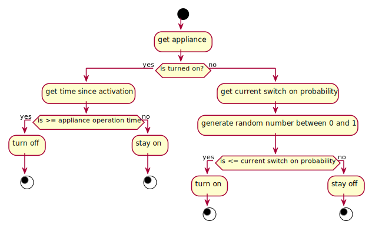
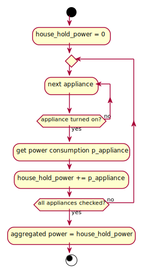

# Simulation Overview

The monte carlo simulation should stochastically calculate the power draw of a household.
The power draw of a house is the aggregate of the power draw of all appliances.
To calculate the power draw of all appliances we determine which one of these are turned on:

Considering the appliances' state the power draw is conceptually calculated as follows:

For every appliance the power draw is determined by a power time series that is read in at the start of the simulation.
The time series can be either constant or variable with respect to the time since it started operating

## Stepwise

1. Instantiate all houses and implement instantiation logic
2. Establish main simulation loop that handles configuration and loops through every time step
3. Implement method that during every time step triggers the possible state transition of all appliances
4. Implement method that handles switches the appliance on or off 
   1. check if device is turned on (by checking if the current time is within the latest `operation_interval`) 
   2. if the device is on we are done 
   3. else sample if device should be turned on
      1. assess switch on probability for current point in time
      2. generate random number and determine new state
   4. if the device is being turned on add the operation time
      1. the operation time interval equals now until now + the length of the time series of the appliance